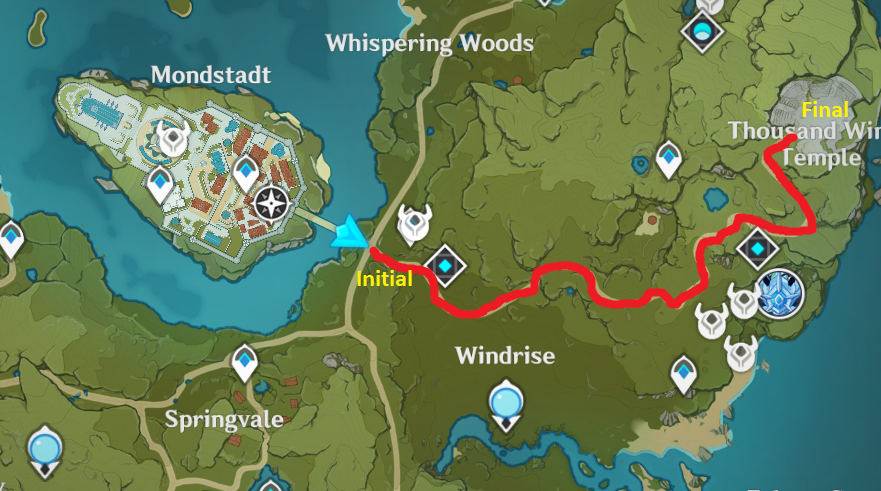
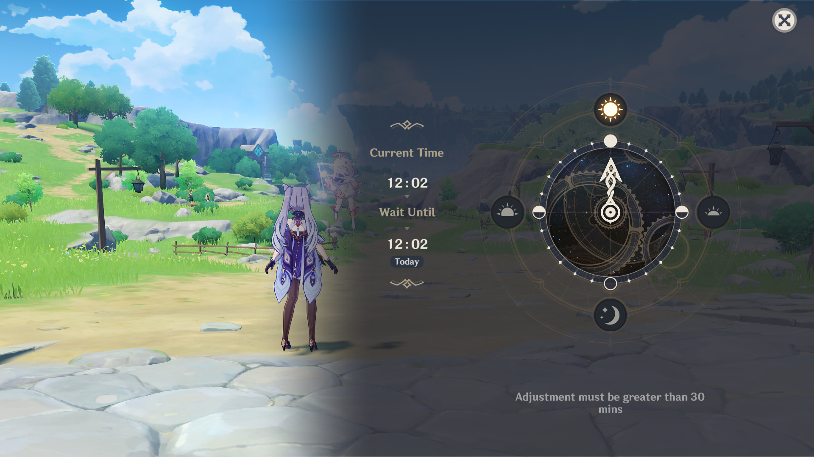
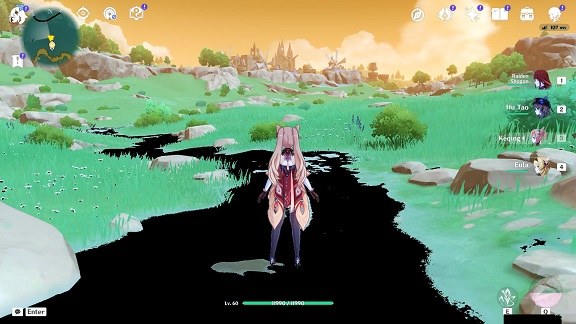
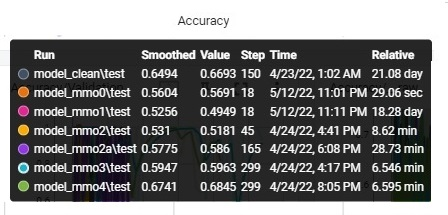
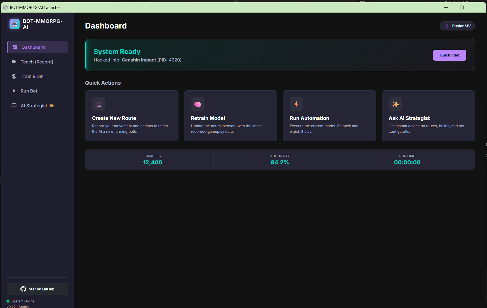
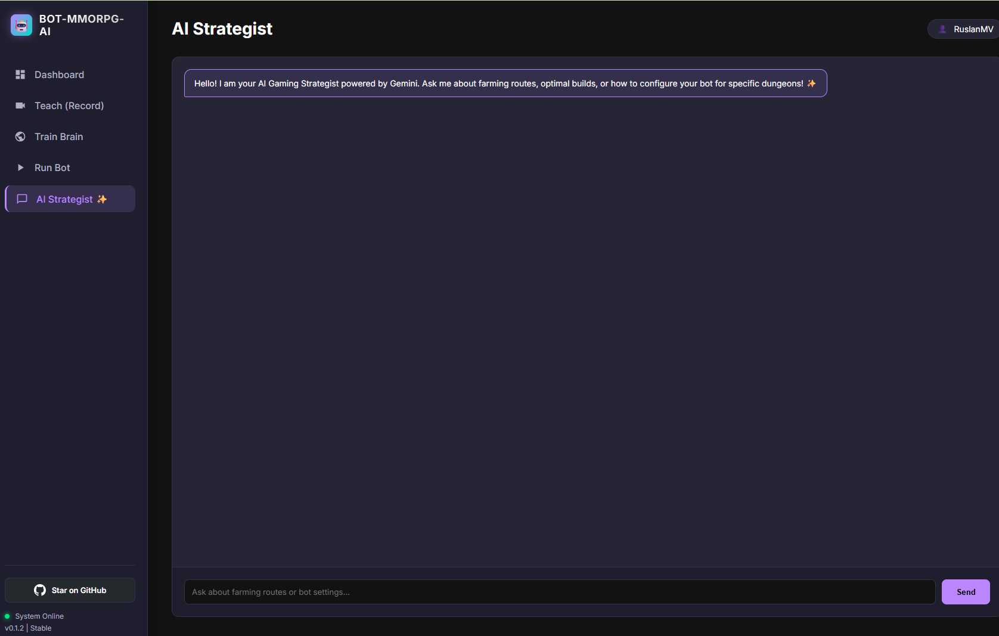
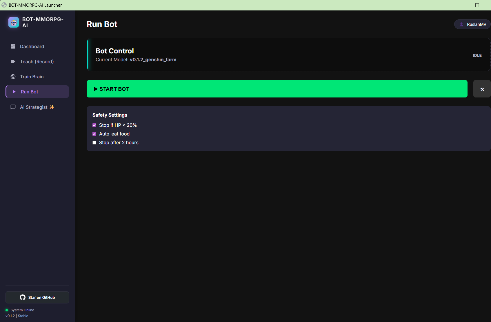

# BOT-MMORPG-AI

<div align="center">


**🎮 The Ultimate AI-Powered Bot for MMORPG and RPG Games 🤖**

*Farm resources, level up, and dominate your favorite games while you sleep!*

[](https://opensource.org/licenses/Apache-2.0)
[](https://www.python.org/downloads/)
[](https://pytorch.org/)
[](https://github.com/psf/black)

[Features](#-why-gamers-love-bot-mmorpg-ai) • [Quick Start](#-quick-start-for-gamers) • [See It In Action](#-see-it-in-action) • [Setup Guide](USAGE.md) • [Support](#-community--support)

</div>

---

## 🎯 What Is This?

**Tired of grinding for hours?** Let AI do it for you!

**BOT-MMORPG-AI** is your personal gaming assistant that uses artificial intelligence to play your favorite MMORPG and RPG games automatically. It watches how YOU play, learns from your gameplay, and then takes over the boring, repetitive tasks while you relax, work, or sleep.

### 🎮 Perfect For

- **Genshin Impact** (Primary Support)
- **New World**
- **World of Warcraft**
- **Guild Wars 2**
- **Final Fantasy XIV**
- **Elder Scrolls Online**
- **And many more!**

### 🌟 What Makes This Special?

Unlike simple macro bots that just repeat actions, this AI **actually learns** how to play by watching you! It uses the same technology behind self-driving cars and facial recognition to understand your game and make smart decisions in real-time.

---

## 🚀 Why Gamers Love BOT-MMORPG-AI

### 💪 Core Features

- ✅ **Auto-Farming**: Collect resources automatically while you're away
- ✅ **Smart Navigation**: Travel from point A to point B without getting stuck
- ✅ **Combat AI**: Fight enemies and complete dungeons autonomously
- ✅ **Item Collection**: Never miss loot again
- ✅ **24/7 Operation**: Farm even when you're sleeping
- ✅ **Human-Like Behavior**: Plays naturally, not like a robot
- ✅ **Controller Support**: Works with keyboard AND gamepad

### 🧠 Advanced Intelligence

- 🎯 **Learns From You**: Records YOUR gameplay and mimics YOUR style
- 🎯 **Adaptive AI**: Gets smarter the more you train it
- 🎯 **Stuck Detection**: Automatically escapes when trapped
- 🎯 **Path Recognition**: Knows where to go using computer vision
- 🎯 **Multi-Action Support**: Handles complex button combinations

---

## 🎬 See It In Action

### Auto-Navigation Example

Navigate from **Mondstadt** to **Thousand Wind Temple** automatically:



*The bot learns the path and can travel autonomously*

### Time-Aware Gameplay



*Set the perfect in-game time for your farming routes*

### Real-Time Bot Performance


*Watch the AI play in real-time with natural, human-like movements*

### Gamepad API Integration


*Full support for controllers and gamepads*

### Path Detection Technology



*Advanced computer vision identifies safe paths and obstacles*

### Training Results



*High accuracy training results - the AI learns quickly!*

---

## 🎮 Quick Start for Gamers

> **Windows 10/11 required.** Linux and macOS are not currently supported for gameplay (training, inference, and input simulation depend on Windows APIs).

**Don't worry - you don't need to be a programmer!** We've made this super simple.

### Option A: Download the Installer (Easiest)

Go to the **[Releases](https://github.com/ruslanmv/BOT-MMORPG-AI/releases)** page and download the latest `.exe` installer. Run it with administrator privileges and follow the wizard. No command line needed!

### Option B: Install from Source

**Prerequisites:** Python 3.10+, Git. For the desktop UI you also need [Rust](https://rustup.rs/) (run `rustup` installer).

```bash
# Just copy and paste these commands one by one
curl -LsSf https://astral.sh/uv/install.sh | sh
git clone https://github.com/ruslanmv/BOT-MMORPG-AI.git
cd BOT-MMORPG-AI
make install
```

**That's it!** The bot is now installed.

> **Note:** `make install` installs core dependencies. Use `make install-all` for everything (launcher, backend, docs). A virtual environment (`.venv/`) is created automatically - you do NOT need to activate it manually.

### Step 2️⃣: Teach The Bot

1. Open your game (Genshin Impact recommended)
2. Set your game resolution to **1920x1080** fullscreen (the bot automatically resizes frames internally for training)
3. Run: `make collect-data`
4. Play normally for 10-15 minutes
5. The bot is now learning!

### Step 3️⃣: Train Your AI

```bash
make train-model
```

Grab a coffee ☕ - training takes 30-60 minutes depending on your GPU.

### Step 4️⃣: Let It Play!

```bash
make test-model
```

**Boom!** Your AI is now playing for you! 🎉

📖 **Need more help?** Check out our [detailed setup guide for gamers](USAGE.md)!

---

## 💻 What You Need

### Minimum Requirements
- **PC**: Windows 10/11 (where you play your game)
- **Python**: 3.8 or newer (we'll help you install it)
- **Space**: 5GB free disk space
- **RAM**: 8GB minimum, 16GB recommended
- **Game**: Any supported MMORPG/RPG game

### Recommended for Best Performance
- **GPU**: NVIDIA Graphics Card (makes training 10x faster!)
- **Controller**: Xbox/PS controller (optional, but recommended)
- **Internet**: For downloading dependencies

### Supported Games
- ✅ **Genshin Impact** (Best Support)
- ✅ New World
- ✅ World of Warcraft
- ✅ Guild Wars 2
- ✅ Final Fantasy XIV
- ✅ Elder Scrolls Online
- ✅ Most other MMORPG/RPG games!

---

## 📦 Installation Options

### 🎮 For Gamers (Recommended - Easy Mode)

See our **[Gamer's Setup Guide](USAGE.md)** - step-by-step with screenshots!

### 👨‍💻 For Developers (Advanced)

<details>
<summary>Click to expand installation commands</summary>

```bash
# Quick Install with UV (Recommended)
curl -LsSf https://astral.sh/uv/install.sh | sh
git clone https://github.com/ruslanmv/BOT-MMORPG-AI.git
cd BOT-MMORPG-AI
make install-all

# Traditional Install
git clone https://github.com/ruslanmv/BOT-MMORPG-AI.git
cd BOT-MMORPG-AI
python -m venv venv
venv\Scripts\activate  # On Windows
pip install -e ".[dev]"
```

</details>

---

## 🎯 How To Use - Visual Guide

### 📍 Step 1: Position Your Character


**Stand at the bridge of Mondstadt** - this is your starting point!

### ⏰ Step 2: Set Game Time


**Set in-game time to 12:00** for consistent lighting and better AI performance

### 🎮 Step 3: Verify Controller (Optional)


**If using a gamepad**, make sure it's connected and recognized

### 🎬 Step 4: Record Your Gameplay

```bash
make collect-data
```

- Play normally for 10-15 minutes
- The AI watches and learns from you
- Press `T` to pause/resume recording
- Press `Q` to stop and save

**💡 Pro Tip**: Play the same route 2-3 times for better results!

### 🧠 Step 5: Train The AI

```bash
make train-model
```

This trains the neural network on your gameplay. Time depends on your hardware:
- **With GPU**: 30-60 minutes
- **Without GPU**: 2-4 hours

☕ Perfect time for a coffee break!

### 🚀 Step 6: Let It Play!

```bash
make test-model
```

1. Position your character at the bridge
2. Set time to 12:00
3. Run the command
4. Switch to game window
5. Watch the magic happen! ✨

**Controls while bot is playing:**
- `T`: Pause/resume the AI
- `ESC`: Stop the bot completely

## 🎮 Interactive Launcher



The **BOT-MMORPG-AI Launcher** is a gaming-style dashboard that lets you manage the entire AI lifecycle without touching the command line. Built with `Eel`, it acts as a central control panel where you can collect data, train your models, and run the bot with a single click.

It features real-time terminal feedback, automatic API key loading, and process management to start or stop tasks instantly.

### 1. Installation

First, install the launcher dependencies (specifically `Eel` and `Chromium` wrappers):

```bash
make install-launcher

```

### 2. Configuration

Ensure you have your API keys set up. Create a `.env` file in the project root (see `.env.example`) and add your Google Gemini API key:

```ini
GEMINI_API_KEY=your_key_here

```

### 3. How to Run

Launch the dashboard using the following command:

```bash
uv run python launcher/launcher.py

```

### 4. Dashboard Features

* **🔴 Start Recording:** Runs `1-collect_data.py` to capture screen data and user inputs for the dataset.
* **🧠 Train Model:** Runs `2-train_model.py` to process the data and train the deep learning model. You will see real-time training logs in the launcher terminal.
* **▶️ Start Bot:** Runs `3-test_model.py` to activate the AI agent and let it play the game autonomously.


---

## 🎥 Complete Tutorial Video

*Coming soon! Subscribe to our YouTube channel for the full walkthrough.*

For now, check our **[detailed written guide](USAGE.md)** with screenshots!

---

## Project Structure

```
BOT-MMORPG-AI/
├── src/
│   └── bot_mmorpg/          # Main package source code
│       ├── __init__.py
│       ├── models/          # Neural network architectures
│       ├── utils/           # Utility functions
│       └── scripts/         # Entry point scripts
│           ├── models_pytorch.py  # PyTorch model architectures
│           ├── train_model.py     # Training script
│           └── test_model.py      # Inference script
├── versions/
│   └── 0.01/                # Version-specific implementations
│       ├── 1-collect_data.py
│       ├── 2-train_model.py
│       ├── 3-test_model.py
│       ├── models_pytorch.py  # PyTorch models (EfficientNet, MobileNet, etc.)
│       ├── grabscreen.py      # Screen capture
│       ├── getkeys.py         # Keyboard input
│       ├── getgamepad.py      # Gamepad input
│       └── directkeys.py      # Key simulation
├── frontend/
│   ├── input_record/        # Input recording utilities
│   └── video_record/        # Video recording utilities
├── modelhub/                # Model metadata and versioning
├── tests/                   # Test suite
├── assets/                  # Images and resources
├── pyproject.toml          # Project configuration
├── Makefile                # Build automation
├── LICENSE                 # Apache 2.0 License
└── README.md              # This file
```

---

## Development

### Code Quality

```bash
# Format code
make format

# Run linters
make lint

# Type checking
make type-check

# Run all checks
make check
```

### Testing

```bash
# Run all tests
make test

# Run with coverage
make test-cov

# Run specific test types
make test-unit        # Unit tests only
make test-integration # Integration tests only
make test-fast        # Exclude slow tests
```

### Building

```bash
# Build distribution packages
make build

# Generate documentation
make docs

# Full CI pipeline
make ci
```

---

## Documentation

### Neural Network Architectures

The project uses **PyTorch 2.x** and supports multiple modern neural network architectures optimized for real-time game AI:

#### 🌟 Modern Models (Recommended)

| Model | Parameters | Temporal | Speed | Best For |
|-------|------------|----------|-------|----------|
| **EfficientNet-LSTM** | ~5M | Yes | ~8ms | Best accuracy with temporal awareness |
| **EfficientNet-Simple** | ~5M | No | ~5ms | Single-frame predictions |
| **MobileNetV3** | ~2M | No | ~3ms | Low-end hardware / real-time |
| **ResNet18-LSTM** | ~12M | Yes | ~10ms | Good balance of speed/accuracy |

#### 🚀 Advanced Models (Experimental)

| Model | Parameters | Features | Best For |
|-------|------------|----------|----------|
| **EfficientNet-Transformer** | ~12M | Transformer attention | Long action sequences (better than LSTM) |
| **Multi-Head Action** | ~6M | Separate output heads | Simultaneous actions (move + attack) |
| **Game Attention Network** | ~6M | Spatial attention | Complex UIs (HP bars, minimap, cooldowns) |

#### 📜 Legacy Models (Compatibility)

| Model | Parameters | Notes |
|-------|------------|-------|
| **InceptionV3** | ~7M | Original architecture |
| **AlexNet** | ~60M | Classic deep learning |
| **SentNet 2D/3D** | ~70M | 3D convolutions for video |

**Recommended**: `efficientnet_lstm` for best results with temporal game context.

### Action Spaces

The bot supports multiple action space configurations for different game types:

| Action Space | Actions | Output Type | Best For |
|--------------|---------|-------------|----------|
| **basic** | 9 | Single-label | WASD movement only (simple routing) |
| **standard** | 29 | Single-label | Keyboard + full gamepad (default) |
| **combat** | 48 | Multi-label | Movement + skills + combat (action RPGs) |
| **extended** | 73 | Multi-label | Full MMORPG (all action categories) |

#### Standard Actions (29)
- **Keyboard** (9): W, S, A, D, WA, WD, SA, SD, NOKEY
- **Gamepad** (20): LT, RT, Lx, Ly, Rx, Ry, D-Pad, Buttons (A, B, X, Y, etc.)

#### Extended Actions (73) - Full MMORPG Support
- **Movement** (16): WASD, jump, sprint, dodge, mount, swim
- **Skills** (20): Hotbar 1-9, F1-F4, Shift+number combos
- **Combat** (12): Attack, block, interact, heal, ultimate, combos
- **Targeting** (8): Tab-target, party targeting, focus
- **Camera** (8): Mouse look, zoom, reset
- **UI** (8): Inventory, map, menus

**Game-Specific Recommendations:**
- **Genshin, Lost Ark, BDO**: `combat` (48 actions, multi-label)
- **WoW, FFXIV**: `extended` (73 actions, multi-label)
- **RuneScape, Albion**: `standard` (29 actions, single-label)

### Resolution Settings

The bot supports variable input resolutions for different performance needs:

| Resolution | Performance | Memory | Recommended For |
|------------|-------------|--------|-----------------|
| **480x270** ⭐ | 1.0x (fastest) | 1.0x | Default - best training speed |
| **640x360** | 0.56x | 1.78x | Good balance of detail/speed |
| **960x540** | 0.25x | 4.0x | Complex UIs (experimental) |
| **1280x720** | 0.14x | 7.1x | HD maximum (experimental) |

**Game-Specific Resolution Presets:**

| Game | Recommended | Notes |
|------|-------------|-------|
| Genshin Impact | 480x270 | Mobile UI scales well |
| World of Warcraft | 640x360 | Complex addon UI |
| Final Fantasy XIV | 640x360 | Detailed hotbars |
| Lost Ark | 640x360 | Many skill indicators |
| Guild Wars 2 | 480x270 | Clean UI design |
| Elder Scrolls Online | 480x270 | Minimal UI |
| Path of Exile | 640x360 | Complex loot system |

### Training Data Format

Data is stored as NumPy arrays:
- **Input**: Screen captures (variable resolution, default 480x270x3 RGB)
- **Output**: Multi-hot encoded action vectors (configurable 9-73 classes)
- **Format**: `.npy` files with 500 samples each

---

## Advanced Features

### Jupyter Notebooks

For interactive development and experimentation:

```bash
# Install Jupyter dependencies
pip install -e ".[jupyter]"

# Launch JupyterLab
jupyter lab
```

Available notebooks in `versions/0.01/`:
- Data collection and preprocessing
- Model training with visualizations
- Data cleaning and augmentation
- Way identification using OpenCV
- Intermediate representation visualization

### Cloud Training

The project supports cloud-based training on:
- **Google Colab**: Free GPU training
- **AWS EMR**: Scalable cluster training
- **Azure ML**: Enterprise-grade training
- **Google Cloud AI Platform**: Distributed training

### Experimental Features

- **Transformer Temporal Models**: EfficientNet backbone with Transformer encoder for better long-range dependencies than LSTM
- **Multi-Head Action Output**: Separate prediction heads for movement/skills/combat/camera - enables simultaneous actions
- **Spatial Attention Networks**: Learn to focus on important screen regions (HP bars, minimap, skill cooldowns)
- **Variable Resolution Support**: Train and run models at different resolutions (480p to 720p)
- **Extended Action Spaces**: Full MMORPG action support with 73 configurable actions
- **Multi-Label Classification**: Predict multiple simultaneous actions (move + cast + dodge)
- **Temporal LSTM Models**: EfficientNet and ResNet backbones with LSTM heads for temporal action prediction
- **3D Convolutions**: SentNet architecture with 3D convolutions for multi-frame temporal learning
- **Mixed Precision Training**: PyTorch AMP for faster training on modern GPUs
- **TorchScript Export**: Optimized model deployment with torch.jit.script

---

## Performance Optimization

### Motion Detection

The bot uses motion detection to prevent getting stuck:
```python
motion_req = 800  # Minimum motion threshold
log_len = 25      # Motion history length
```

When stuck, the bot executes random evasive maneuvers.

### Prediction Weighting

Custom weights applied to predictions for game-specific behavior:
```python
weights = [4.5, 0.1, 0.1, 0.1, 1.8, 1.8, 0.5, 0.5, 0.2, ...]
```

---

## Troubleshooting

### Common Issues

**Issue**: Model not loading
- **Solution**: Ensure model files are in `model/` directory

**Issue**: Screen capture not working
- **Solution**: Run game in fullscreen 1920x1080 resolution

**Issue**: Bot getting stuck
- **Solution**: Adjust `motion_req` threshold in test script

**Issue**: Low FPS during recording
- **Solution**: Lower capture resolution or use faster storage

**Issue**: CUDA out of memory
- **Solution**: Reduce batch size in training configuration

---

## Contributing

We welcome contributions from the community!

### How to Contribute

1. **Fork** the repository
2. **Create** a feature branch (`git checkout -b feature/amazing-feature`)
3. **Commit** your changes (`git commit -m 'Add amazing feature'`)
4. **Push** to the branch (`git push origin feature/amazing-feature`)
5. **Open** a Pull Request

### Development Guidelines

- Follow PEP 8 style guidelines
- Add docstrings to all functions and classes
- Include type hints for function signatures
- Write unit tests for new features
- Update documentation as needed
- Run `make check` before submitting

### Code of Conduct

Please read our [Code of Conduct](CODE_OF_CONDUCT.md) before contributing.

---

## 💬 Community & Support

### Join Our Gaming Community!


**Get Help, Share Tips, Show Off Your Bots!**

- 💬 **Slack**: [#bot-mmorpg-ai](https://ruslanmv.slack.com/archives/C0A5N63DKSS) - Live chat with other gamers
- 🐛 **Report Issues**: [GitHub Issues](https://github.com/ruslanmv/BOT-MMORPG-AI/issues) - Found a bug?
- 🌐 **Website**: [ruslanmv.com](https://ruslanmv.com/) - Tutorials and guides
- 📧 **Email**: contact@ruslanmv.com - Direct support

### Get Updates

- ⭐ **Star this repo** to get updates
- 👁️ **Watch** for new releases
- 🔔 **Subscribe** to our YouTube (coming soon!)

---

## Acknowledgments

This project builds upon excellent work from the community:

- **[PyTorch](https://pytorch.org/)** - The deep learning framework powering our AI
- **[torchvision](https://pytorch.org/vision/)** - Pre-trained models (EfficientNet, MobileNetV3, ResNet)
- **[gamePyd](https://github.com/4amVim/gamePyd)** - Game control utilities
- **[vJoy](http://vjoystick.sourceforge.net/)** - Virtual joystick interface
- **[ScpVBus](https://github.com/nefarius/ScpVBus)** by [nefarius](https://github.com/nefarius)
- **[PYXInput](https://github.com/bayangan1991/PYXInput)** contributors
- **[PyGTA5](https://github.com/Sentdex/pygta5)** by Sentdex

Special thanks to the AI Gaming Community for their continuous support and feedback.

---

## Roadmap

- [ ] Multi-game support framework
- [ ] Web-based dashboard for monitoring
- [ ] Improved data augmentation pipeline
- [ ] Distributed training support
- [ ] Reinforcement learning integration
- [ ] Real-time model updating
- [ ] Cloud storage integration (S3, MinIO)
- [ ] Performance profiling tools
- [ ] Generalized game agent framework
- [ ] Plugin system for custom games
- [ ] Advanced reward shaping
- [ ] Model compression for edge deployment

---

## Citation

If you use this project in your research, please cite:

```bibtex
@software{magana2025botmmorpgai,
  author = {Magana Vsevolodovna, Ruslan},
  title = {BOT-MMORPG-AI: AI-Powered Bot for MMORPG Games},
  year = {2025},
  url = {https://github.com/ruslanmv/BOT-MMORPG-AI},
  version = {1.0.0}
}
```

---

## License

This project is licensed under the **Apache License 2.0** - see the [LICENSE](LICENSE) file for details.

```
Copyright 2025 Ruslan Magana Vsevolodovna

Licensed under the Apache License, Version 2.0 (the "License");
you may not use this file except in compliance with the License.
You may obtain a copy of the License at

    http://www.apache.org/licenses/LICENSE-2.0

Unless required by applicable law or agreed to in writing, software
distributed under the License is distributed on an "AS IS" BASIS,
WITHOUT WARRANTIES OR CONDITIONS OF ANY KIND, either express or implied.
See the License for the specific language governing permissions and
limitations under the License.
```

---

## Author

**Ruslan Magana Vsevolodovna**

- Website: [ruslanmv.com](https://ruslanmv.com/)
- Email: contact@ruslanmv.com
- GitHub: [@ruslanmv](https://github.com/ruslanmv)

---

## Star History

[](https://star-history.com/#ruslanmv/BOT-MMORPG-AI&Date)

---

<div align="center">

**Made with ❤️ by the AI Gaming Community**

[⬆ back to top](#bot-mmorpg-ai)

</div>
