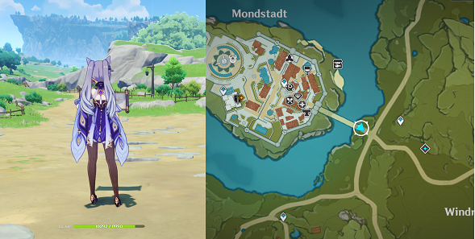
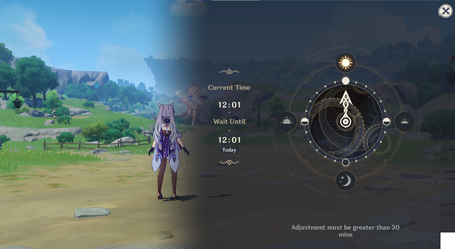
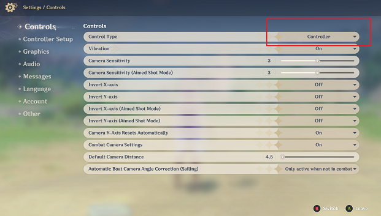

# 🎮 BOT-MMORPG-AI - Gamer's Setup Guide

**Welcome, Gamer!** 👋

This guide will help you set up your AI bot step-by-step, even if you've never coded before. We'll use simple language and lots of screenshots. Let's get your bot farming for you!

---

## 📋 What You'll Need (Checklist)

Before we start, make sure you have:

- [ ] A Windows PC (Windows 10 or 11)
- [ ] Your game installed (Genshin Impact recommended)
- [ ] At least 5GB of free disk space
- [ ] About 1 hour of free time for setup
- [ ] Your game controller (optional, but helpful)
- [ ] A cup of coffee ☕ (optional, but recommended!)

---

## 🚀 Part 1: Installing Python (The Brain)

Python is the programming language that powers the AI. Don't worry - you won't need to learn it!

### Step 1: Download Python

1. Go to: [https://www.python.org/downloads/](https://www.python.org/downloads/)
2. Click the big yellow "Download Python 3.11" button
3. Save the file to your Downloads folder

### Step 2: Install Python

1. Double-click the downloaded file
2. **IMPORTANT**: Check the box that says "Add Python to PATH" ✅
3. Click "Install Now"
4. Wait for it to finish (2-3 minutes)
5. Click "Close"

### Step 3: Verify It Worked

1. Press `Windows Key + R`
2. Type `cmd` and press Enter
3. In the black window, type: `python --version`
4. You should see something like: `Python 3.11.x`

✅ **Success!** Python is installed!

---

## 📥 Part 2: Getting The Bot Files

Now we'll download the bot software to your computer.

### Step 1: Install Git (Download Manager)

1. Go to: [https://git-scm.com/download/win](https://git-scm.com/download/win)
2. Download will start automatically
3. Run the installer
4. Click "Next" through all options (defaults are fine)
5. Click "Finish"

### Step 2: Download The Bot

1. Press `Windows Key + R`
2. Type `cmd` and press Enter
3. Copy and paste this command (right-click to paste in cmd):

```bash
cd Desktop
```

Press Enter. This moves to your Desktop.

4. Now paste this command:

```bash
git clone https://github.com/ruslanmv/BOT-MMORPG-AI.git
```

Press Enter and wait. You'll see text scrolling - that's normal!

5. When it's done, you'll have a new folder on your Desktop called "BOT-MMORPG-AI"

✅ **Success!** You've downloaded the bot!

---

## 🔧 Part 3: Installing The Bot

Now we'll install all the AI components.

### Step 1: Open Command Prompt in Bot Folder

1. Open the "BOT-MMORPG-AI" folder on your Desktop
2. Hold `Shift` and right-click in the empty space
3. Click "Open PowerShell window here" or "Open command window here"

### Step 2: Install UV Package Manager

Paste this command:

```bash
curl -LsSf https://astral.sh/uv/install.sh | sh
```

If that doesn't work (on Windows), use this instead:

```bash
powershell -c "irm https://astral.sh/uv/install.ps1 | iex"
```

Wait for it to finish (1-2 minutes).

### Step 3: Install The Bot

Paste this command:

```bash
make install
```

**Don't have `make`?** No problem! Use this instead:

```bash
pip install -e .
```

This will take 5-10 minutes. You'll see lots of text - that's normal! The AI is installing all its components.

☕ **Pro Tip**: This is a good time for that coffee!

✅ **Success!** The bot is installed!

---

## 🎮 Part 4: Setting Up Your Game

Let's prepare your game for the bot to learn.

### Step 1: Game Settings

1. **Open your game** (Genshin Impact)
2. **Set resolution**:
   - Press `ESC` → Settings → Graphics
   - Set to `1920 x 1080` (fullscreen)
   - Apply and restart if needed

### Step 2: Position Your Character



1. **Teleport to Mondstadt**
2. **Go to the bridge** (see screenshot above)
3. **Face towards Thousand Wind Temple**

### Step 3: Set The Time



1. Open your menu
2. Set in-game time to **12:00** (noon)
3. This keeps lighting consistent for the AI

### Step 4: Controller Check (Optional)



If using a controller:
1. **Plug it in before starting**
2. **Verify it works** in game settings
3. **Set it to controller mode** in game

✅ **Success!** Your game is ready!

---

## 🎓 Part 5: Teaching The AI (Data Collection)

Now the fun part - teaching the AI how YOU play!

### Step 1: Start Recording

In your command prompt (in the BOT-MMORPG-AI folder), type:

```bash
make collect-data
```

Or if that doesn't work:

```bash
python versions/0.01/1-collect_data.py
```

### Step 2: Play Normally

1. **You'll see a countdown**: 4... 3... 2... 1...
2. **Switch to your game window**
3. **Play normally for 10-15 minutes**:
   - Walk around your farming route
   - Fight some enemies
   - Collect items
   - Jump, run, use skills

**The bot is watching and learning from you!** 👀

### Step 3: Recording Controls

While recording:
- Press `T` to **pause/resume** (if you need a break)
- Press `Q` to **stop and save** (when done)

### Step 4: What To Record

**Good recordings include:**
- Walking your farming route 2-3 times
- Fighting the same enemies repeatedly
- Collecting items
- Normal gameplay patterns

**Avoid:**
- Opening menus
- Checking inventory
- Cutscenes
- AFK time

### Step 5: Check Your Data

After recording, you should see files like:
- `preprocessed_training_data-1.npy`
- `preprocessed_training_data-2.npy`
- etc.

**More files = Better training!** Aim for at least 5-10 files (about 15 minutes of gameplay).

💡 **Pro Tip**: You can run this multiple times to collect more data!

✅ **Success!** You've taught the AI!

---

## 🧠 Part 6: Training The AI (The Magic Happens)

Now we'll train the AI on your gameplay.

### Step 1: Start Training

In your command prompt, type:

```bash
make train-model
```

Or:

```bash
python versions/0.01/2-train_model.py
```

### Step 2: Wait For Training

You'll see text scrolling with numbers and progress. This is NORMAL!

**Training Time:**
- With NVIDIA GPU: 30-60 minutes ⚡
- Without GPU: 2-4 hours 🐌

**What's happening:**
- The AI is studying your gameplay
- It's learning which buttons to press
- It's building a "brain" (neural network)

### Step 3: You'll Know It's Done When...

You see messages like:
- `SAVING MODEL!`
- Training completes without errors
- You're back at the command prompt

**Don't close the window!** Let it finish completely.

✅ **Success!** Your AI is trained!

---

## 🚀 Part 7: Running The Bot (Time To Farm!)

The moment you've been waiting for - let's run your bot!

### Step 1: Position Your Character

1. **Open your game**
2. **Go to the bridge of Mondstadt** (same starting position)
3. **Set time to 12:00**
4. **Make sure controller is connected** (if you used one)

### Step 2: Start The Bot

In command prompt:

```bash
make test-model
```

Or:

```bash
python versions/0.01/3-test_model.py
```

### Step 3: Watch The Magic

1. **You'll see a countdown**: 4... 3... 2... 1...
2. **Switch to your game window**
3. **Take your hands OFF the controls!** 🙌
4. **Watch the AI play!**


### Step 4: Bot Controls

While the bot is running:
- Press `T` to **pause/resume** the AI
- Press `ESC` to **stop** the bot completely

### Step 5: Troubleshooting

**Bot is stuck?**
- It will auto-escape after a few seconds
- Or press `T` to pause, reposition manually, press `T` again

**Bot not moving?**
- Make sure you're at the starting position
- Make sure time is set to 12:00
- Try recording more training data

**Bot doing weird things?**
- Normal at first! It learns from mistakes
- Record more training data
- Try training again

✅ **Success!** Your bot is farming for you!

---

## 🎯 Part 8: Advanced Tips

### Making Your Bot Better

**1. More Training Data = Smarter Bot**
- Record 30+ minutes of gameplay
- Play the same route multiple times
- Be consistent with your actions

**2. Retrain Periodically**
- If bot behaves badly, collect more data
- Retrain with: `make train-model`
- Each training session improves the AI

**3. Multiple Routes**
- You can train different bots for different routes
- Rename your model files to keep them separate
- Example: `model/mondstadt`, `model/liyue`

### Running 24/7

**Safety First:**
- Don't leave completely unattended
- Check every few hours
- Respect the game's ToS (Terms of Service)

**Power Settings:**
- Set PC to never sleep
- Disable screen timeout
- Keep game in fullscreen

**Performance:**
- Close other programs
- Use a wired controller (more stable)
- Lower graphics settings if needed

---

## ❓ Common Questions (FAQ)

### Q: Do I need to know programming?
**A:** Nope! Just follow this guide.

### Q: Will I get banned?
**A:** Use at your own risk. Read your game's Terms of Service. We recommend using this for educational purposes only.

### Q: Can I use this for PvP?
**A:** Not recommended. This is designed for farming/grinding, not competitive play.

### Q: My game is not in the supported list. Will it work?
**A:** Possibly! Any 3D RPG/MMORPG might work. You'll need to experiment.

### Q: The bot keeps getting stuck!
**A:** Record more training data showing how to navigate obstacles. The AI learns from you!

### Q: Can I use this on console?
**A:** No, this only works on PC (Windows).

### Q: How much does this cost?
**A:** FREE! It's open source (Apache 2.0 license).

### Q: I'm stuck! Where can I get help?
**A:** Join our Slack community: [aws-ml-group.slack.com](https://aws-ml-group.slack.com/)

---

## 🆘 Getting Help

### If Something Goes Wrong

1. **Read error messages** - they usually tell you what's wrong
2. **Check our GitHub Issues**: [Issues Page](https://github.com/ruslanmv/BOT-MMORPG-AI/issues)
3. **Ask in Slack**: [Join Here](https://aws-ml-group.slack.com/)
4. **Email**: contact@ruslanmv.com

### When Asking For Help, Include:

- What you were trying to do
- The exact error message (screenshot helps!)
- Your Windows version
- Your Python version (`python --version`)
- What you've already tried

---

## 🎉 Congratulations!

You've successfully set up your AI gaming bot! Here's what you accomplished:

- ✅ Installed Python and all dependencies
- ✅ Downloaded the bot software
- ✅ Recorded your gameplay
- ✅ Trained an AI on your playstyle
- ✅ Got the bot running and farming for you!

**Welcome to the future of gaming!** 🚀

### What's Next?

- Experiment with different routes
- Train multiple bots for different tasks
- Share your results in our community
- Help other gamers get started!

### Show Off Your Bot!

Got cool results? Share them!
- Post in our Slack channel
- Tweet with #BOTMMORPGAI
- Make a YouTube video

---

## 📚 Additional Resources

- **Main README**: [README.md](README.md) - Technical documentation
- **Contributing**: [CONTRIBUTING.md](CONTRIBUTING.md) - Want to improve the bot?
- **Changelog**: [CHANGELOG.md](CHANGELOG.md) - What's new in each version

---

## ❤️ Thank You!

Made with ❤️ by **Ruslan Magana Vsevolodovna**

- 🌐 Website: [ruslanmv.com](https://ruslanmv.com/)
- 📧 Email: contact@ruslanmv.com
- ⭐ Star this repo if it helped you!

**Happy Farming!** 🎮✨

---

*Remember: Use responsibly and respect your game's Terms of Service. This is an educational project!*
